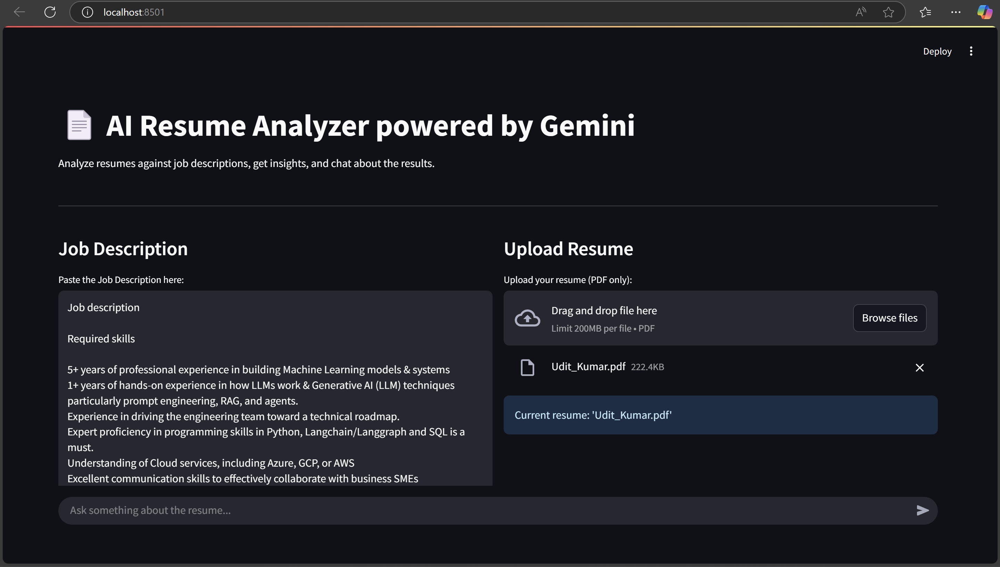
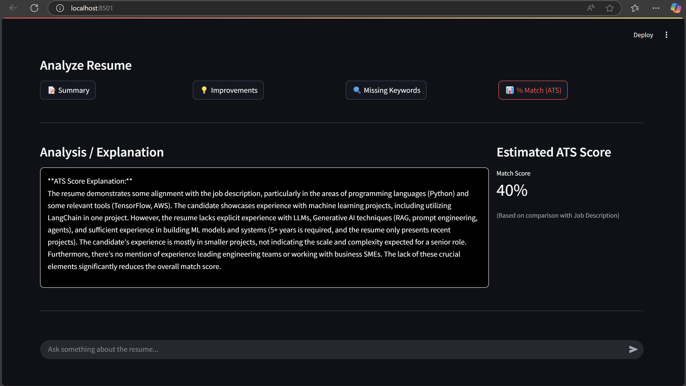
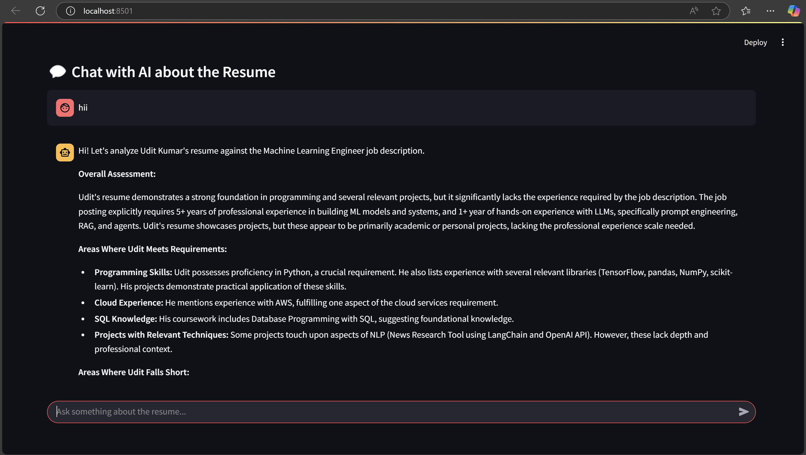

# Real Time Ats Score Checker Using Gemini

Analysis the Resume and check the ats score also chat with the bot about your resume

#### How to run
- clone the Project
- SetUp the .env File and place the gemini api key
- Install `pip install streamlit google-generativeai python-dotenv pymupdf` 

#### Use
- streamlit - For Ui
- google-generativeai - For Gemini
- python-dotenv - For Env Variable
- pymupdf - Extract Word from the pdf
## Outputs

